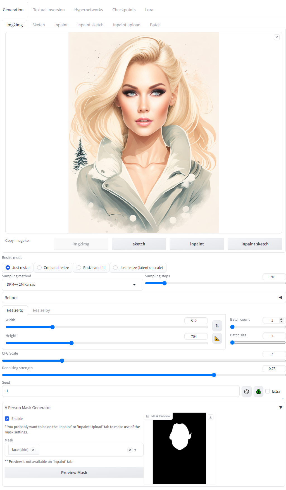
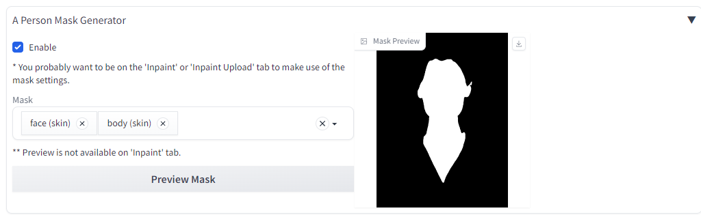
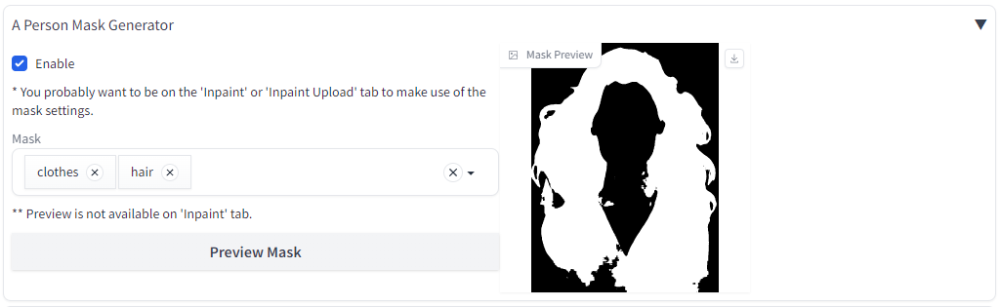
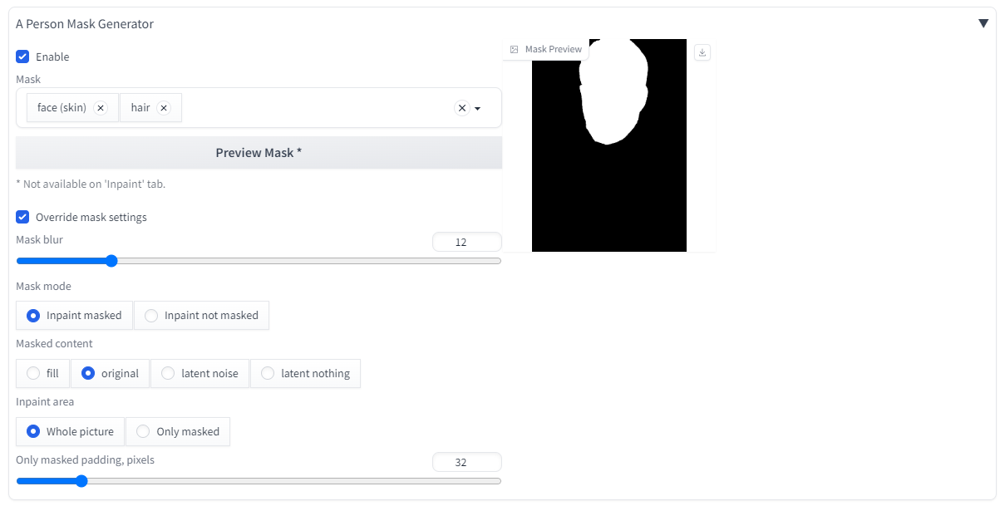
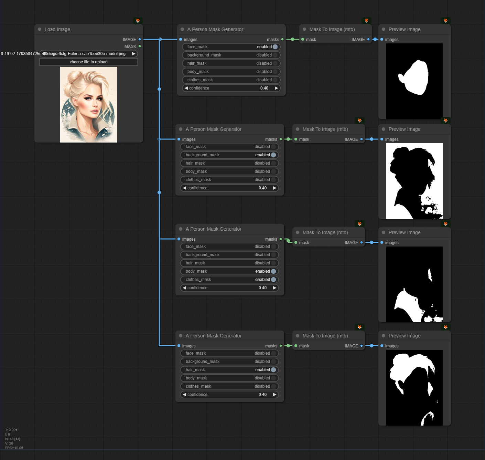
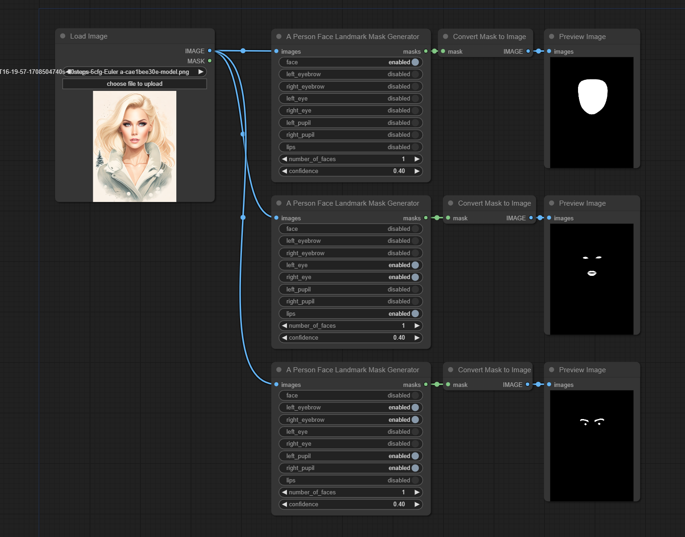

# a-person-mask-generator
Extension for Automatic1111 and ComfyUI to automatically create masks for Background/Hair/Body/Face/Clothes in Img2Img

Uses the [Multi-class selfie segmentation model](https://developers.google.com/mediapipe/solutions/vision/image_segmenter#multiclass-model) model by Google.

## Updates
- 2025-02-07 - Fixing ComfyUI vs Auto1111 (improved ComfyUI by adding alpha channel to the image that gets passed to media pipe.  See [issue #47](https://github.com/djbielejeski/a-person-mask-generator/issues/47))
- 2024-05-26 - Adding facial landmark mask outputs for ComfyUI
- 2024-05-25 - Fixed ComfyUI requirements and install
- 2024-01-01 - Added ComfyUI support
- 2023-11-16 - Initial release

## Install - Automatic1111 Web UI

(from Mikubill/sd-webui-controlnet)

1. Open "Extensions" tab.
2. Open "Install from URL" tab in the tab.
3. Enter `https://github.com/djbielejeski/a-person-mask-generator.git` to "URL for extension's git repository".
4. Press "Install" button.
5. Wait 5 seconds, and you will see the message "Installed into stable-diffusion-webui\extensions\a-person-mask-generator. Use Installed tab to restart".
6. Go to "Installed" tab, click "Check for updates", and then click "Apply and restart UI". (The next time you can also use this method to update extensions.)
7. Completely restart A1111 webui including your terminal. (If you do not know what is a "terminal", you can reboot your computer: turn your computer off and turn it on again.)


## Install - ComfyUI

1. Navigate to your ComfyUI folder, then into the `custom_nodes` folder in a `CMD` window and run the following command

```
git clone https://github.com/djbielejeski/a-person-mask-generator
```

### Example
```cmd
D:\ComfyUI\custom_nodes>git clone https://github.com/djbielejeski/a-person-mask-generator
```

2. Restart ComfyUI.


## Automatic1111 Examples

### Face


### Face + Body


### Clothes + Hair


### Mask Settings



## ComfyUI Example - Person

Workflow embedded in image, drag into ComfyUI to use.

Masks in this order

1) Face
2) Background
3) Body + Clothes
4) Hair



## ComfyUI Example - Face Landmarks


